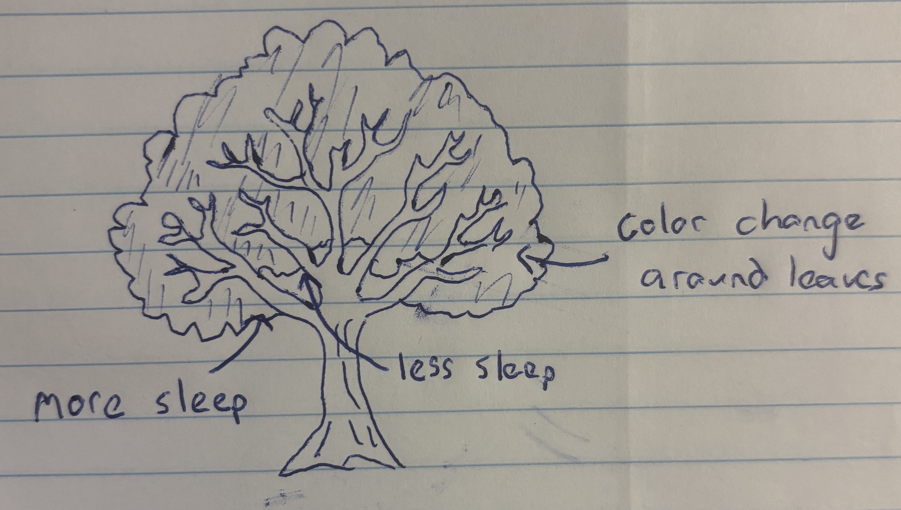
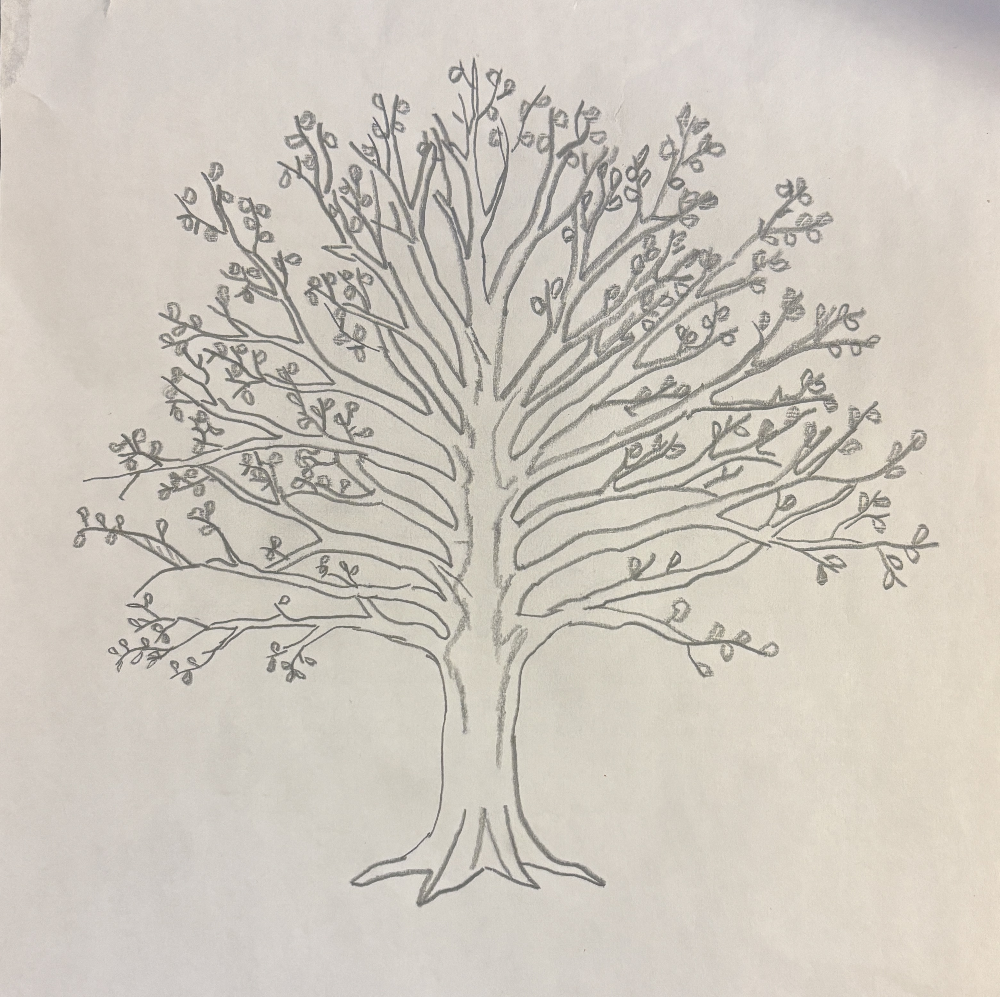
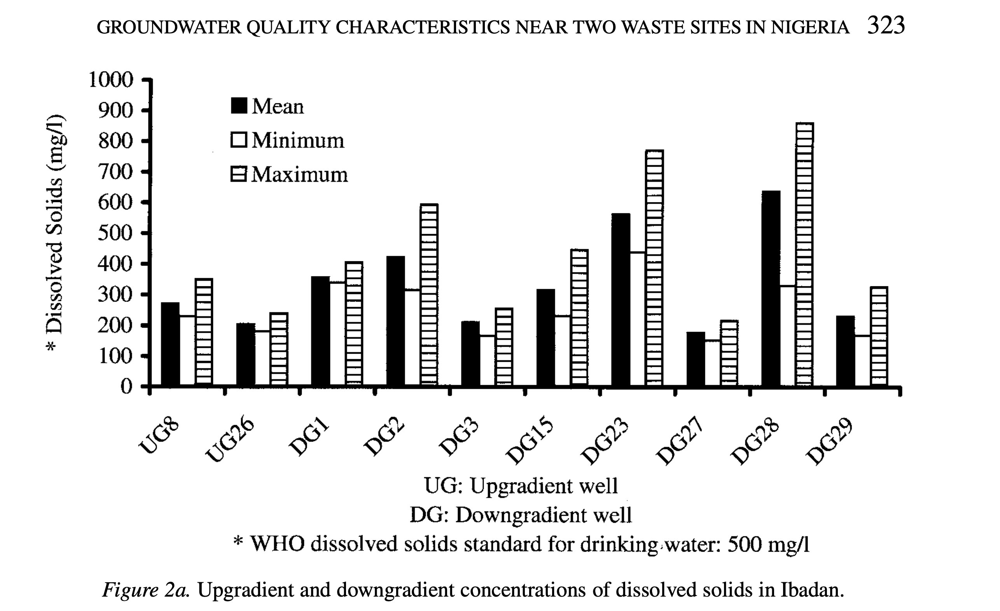
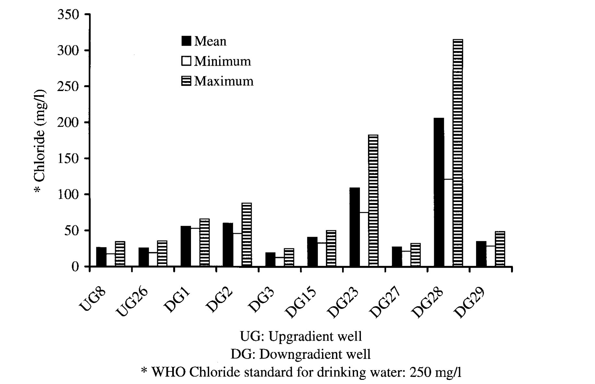

[GitHubrepository](https://github.com/aidensoller-glitch/ENVS-193DS_homework-03.git)

```{r}
#| message: false
#| warning: false
library(tidyverse)

library(janitor)

library(gt)

library(car)

library(rstatix)

library(dplyr)

library(here)

salinity<- read_csv("../data/salinity-pickleweed.csv") #read in soil salinity data

sleep_calendar <- read_csv("../data/sleep_schedule.csv") # read in project data as an object called sleep_calendar
```

# Problem 1: Slough Soil Salinity

# a. An appropriate test

Two appropriate tests to determine the strength of the relationship are Pearson's product movement correlation and Spearman's rank correlation. Pearson correlation measures both the strength and direction of the linear relationship between soil salinity and pickleweed biomass, while avoiding the assumption that one variable causes the other. Comparatively Spearman's rank correlation measures still measures the strength and direction of a **monotonic relationship** by using the 2 **ranked values** of salinity and biomass rather than the raw measurements, making it a more appropriate test if the data are not normally distributed.

# b. Create a visualization

```{r}
ggplot(data = salinity, # use salinity data frame
       aes(x = salinity_mS_cm, y = pickleweed))+ # set x variable as salinity and y variable as pickleweed
  geom_point(color = "darkgreen", size = 3) + # add points and adjust color and size
  labs(
    x = "Soil Salinity (mS/cm)", # label x axis
    y = "California Pickleweed Biomass (g)", # label y axis
    title = "Relationship Between Soil Salinity and Pickleweed Biomass" # add title
  ) +
  theme_minimal() # use a minimal theme
```

# c. Check your assumptions and run your test

## Checking Assumptions

1.  Linear Relationship: Yes, a linear relationship is expected between soil salinity and pickleweed biomass as determined in plot 1b. Factors such as salinity influence plant growth, so a change in soil salinity would correspond to an increase or decrease in biomass.

2.  Variables are Continuous and 3. Normally Distributed:

```{r}
ggplot(data = salinity, # use salinity data frame
       aes(sample = salinity_mS_cm)) + # use salinity_mS_cm only
  geom_qq(color = "blue") + # add points and adjust color and size
  geom_qq_line(color = "orange") + # create a reference line
  labs(x = "Theoretical", # add x axis label
       y = "Sample", # add y axis label
    title = "QQ of Soil Salinity") + #adds graph title
  theme_minimal() #changes theme 
```

```{r}
ggplot(data = salinity, # use salinity data frame
       aes(sample = pickleweed)) + # use salinity_mS_cm only
  geom_qq(color = "blue") + # add points and adjust color and size
  geom_qq_line(color = "orange") + # create a reference line
  labs(x = "Theoretical", # add x axis label
       y = "Sample", # add y axis label
    title = "QQ of Pickleweed Biomass") + #adds graph title
  theme_minimal() #changes theme 
```

4.  Independent Observations: Each pickleweed plant was sampled individually from the slough, so the measurement from one plant does not influence the measurement from another.

Assumption Description: In order to run a Pearson’s correlation, I checked four assumptions: that the relationship between soil salinity and pickleweed biomass is linear, that both variables are continuous and normally distributed, and that observations are independent. I assessed linearity by visually inspecting the scatterplot of pickleweed biomass vs. soil salinity from part 1b, checked normality using Q–Q plots for both variables, confirmed continuity because both biomass and salinity can take on a range of numerical values, and verified independence because each pickleweed plant was sampled individually from the slough. The scatterplot showed an approximately linear positive relationship, the Q–Q plots had points roughly along the reference line, and the study design supports independence, so the assumptions appear to be reasonably satisfied.

## Running Test

```{r}
cor.test(salinity$salinity_mS_cm, salinity$pickleweed,
         method = "pearson") # running a pearson's correlation test using salinity and pickleweed biomass data.
```

# d. Results communication

To evaluate the relationship between California pickleweed biomass and soil salinity, I used a Pearson’s product–moment correlation because both soil salinity and pickleweed biomass are continuous variables, and my assumption checks suggested that the assumptions required for a Pearson correlation were reasonably satisfied.

The test reveals a moderate, positive, and statistically significant relationship between soil salinity and plant biomass, indicating that pickleweed plants at this restoration site tend to grow larger as soil salinity increases (Pearson’s r = 0.53, t(21) = 2.90, p = 0.009, α = 0.05).

# e. Test implications

The results suggest that pickleweed biomass tends to increase as soil salinity increases, indicating that plants at this site grow larger in areas with higher salinity. While salinity does not explain all of the variation in biomass, the positive and statistically significant relationship suggests that moderately higher salinity conditions may support better pickleweed growth. For planting efforts, this means it may be beneficial to prioritize areas of the slough with higher soil salinity when selecting locations for new pickleweed plantings.

# f. Double check your own work

```{r}
cor.test(salinity$salinity_mS_cm, salinity$pickleweed, 
         method = "spearman") # Running a spearman's correlation test using salinity and pickleweed biomass data.
```

Both the Pearson’s correlation and the Spearman’s rank correlation would lead to rejecting the null hypothesis because both produce statistically significant p-values (Pearson: p = 0.0086; Spearman: p = 0.0034). The Pearson test summarizes the strength and direction of the linear relationship between soil salinity and pickleweed biomass (r ≈ 0.53), while the Spearman test assesses the strength and direction of the monotonic relationship (ρ ≈ 0.59), which is based on the ranked values rather than the raw measurements. Although the two tests approach the relationship differently, they both indicate that higher soil salinity is associated with greater pickleweed biomass at this site.

# Problem 2. Personal data

Cleaning Data:

```{r}
sleep_calendar$duration_hours <- 
  as.numeric(substr(sleep_calendar$duration_hr_mm_ss,1,2)) +  # Extract hours from first 2 characters and convert to numbers
  as.numeric(substr(sleep_calendar$duration_hr_mm_ss,4,5))/60 # Extract minutes from the 4th and 5th characters, convert to numbers and divide by 60 to get fraction of hour

  sleep_calendar$half_of_week <- factor(sleep_calendar$half_of_week) # Convert half_of_week column to categories (factor)
```

# a. Updating your visualizations

```{r}
ggplot(data = sleep_calendar,
       aes(x = factor(half_of_week, # convert half_of_week to categories
                      levels = c(1,2,3),
                      labels = c("1st Half", "2nd Half", "Weekend")), # add labels for x-axis
           y = duration_hr_mm_ss,
           color = factor(half_of_week,
                          levels = c(1,2,3),
                          labels = c("1st Half", "2nd Half", "Weekend"))))+ #color points by half_of_week categories
 geom_jitter(width = 0.15, # change width
              size = 3, # change size of points
              alpha = 1, # alter transparency
              shape = 21, # shape that supports fill + outline
              stroke = 0.8, # thickness of black outline
              fill = "white") + # inner fill color
  scale_color_manual(values = c("1st Half" = "darkblue",
                                "2nd Half" = "red",
                                "Weekend" = "green")) + # set custom colors by category
  labs(
    title = "Sleep Duration Changes Between Parts of the Week", # add title
    subtitle = paste("Most recent observation:", "Thursday, Mar 5, 2026"), # add subtitle
    x = "Half of the week (Mon/Tues, Wed/Thurs, Weekend)", # label x axis
    y = "Sleep Duration (hours)", # label y axis
    color = "Section of the Week" # label legand
  ) +
  theme_light() # change theme

```

```{r}
ggplot(sleep_calendar,
       aes(x = sleepBPM, # Set x as average sleep heart rate 
           y = duration_hr_mm_ss)) + # set y as sleep duration
  geom_point(color = "darkorange", # add custom color
             size = 3, # change size
             alpha = 0.8) + # alter transparency
  labs(
    title = "Sleep Duration compared to Average Sleeping Heart Rate", # add title
    subtitle = "Most recent observation: Mar 5, 2026", # add subtitle
    x = "Average Sleep Heart Rate (BPM)", # label x axis
    y = "Sleep Duration (hours)" # label y axis
  ) +
  theme_minimal(base_size = 14) + # non-default theme
  theme(panel.grid.major = element_blank(),  
        panel.grid.minor = element_blank(),
        panel.border = element_blank()) # remove grid lines
```

# b. Captions

Figure 1: Sleep Duration Changes Between Parts of the Week: This jittered scatterplot illustrates nightly sleep duration (hours) across three sections of the week: 1st Half (Monday–Tuesday), 2nd Half (Wednesday–Thursday), and Weekend (Friday–Sunday). Each point is a white circle with moderate transparency and slight horizontal jitter to show individual observations while minimizing overlap. The points are colored according to blue for 1st Half, red for 2nd Half, and green for Weekend. The plot uses a light theme for a cleaner look, and the subtitle notes the most recent observation recorded on Thursday, March 5th, 2026. The visualization highlights that sleep duration tends to increase slightly toward the weekend, with variability visible within each section.

Figure 2: Sleep Duration vs Average Sleeping Heart Rate: This scatterplot illustrates nightly sleep duration (hours) in relation to average sleeping heart rate (BPM). Each point is a dark orange circle with moderate transparency, showing individual nights while minimizing overlap. The plot uses a minimal theme and the subtitle notes the most recent observation recorded on Thursday, March 5th, 2026. The visualization reveals variation in sleep duration across different heart rates, with nights of lower heart rate generally corresponding to slightly longer sleep duration.

# Problem 3. Affective visualization

# a. Describe in words what an affective visualization could look like for your personal data

An affective visualization that could represent my personal data is a drawing of a tree. To represent my data I would divide the tree into two halves, with the left side representing the first half of the week and the right side representing the second half. Based on the duration of my sleep that night, the tree branch would be scaled to match. Additionally, the leaf color of each branch could be changed to match my average sleep heart rate, with greener leaves corresponding to a lower heart rate. As a result, a viewer could assess whether the tree is lopsided or symmetrical and identify the color of the tree leaves to see how side of the tree or leaf color impacted sleep duration.

# b. Create a sketch (on paper) of your idea.



# c. Make a draft of your visualization



# d. Write an artist statement

## Content:

My piece aims to show the health of my sleep data through the medium of a tree, showing how metrics of health data like heart rate and indicators like the what part of the week it is can have a impact on a person's duration of sleep. By connecting my predictor and response variables into a cohesive piece, I show the viewer the connection between my variables. By using a tree, I hope to bring life and health to mind, connecting the viewer to my art and potentially causing them to reflect on their own sleep health.

## Influences:

In the creation of the piece I find myself influenced by works such as Lorraine Woodruff-Long's warming strips quilt and the presentation of a family lineage tree. The way Long makes use of color, shape, and gradient to connect with their viewer to draw them into the data appeals to me. I want people to experience the data in the way the warming strips quilt encourages people to, leaning on the format and connection inherent in a family tree.

## Form:

My work will be made freehand on paper. By making a pencil sketch I can more accurately and consistently measure out the length of my branches and color of my leaves. As a result, differences throughout the tree will be more pronounced and intentional.

## Process:

I created my artwork through references on my phone and online. I measured out a branch that I called "8 hours of sleep" Once a branch is complete, I moved onto the next one, repeating until I covered the entire tree, altering the lengths to match their represented hours accordingly. By altering the placement and angle of branches as I work, I hope to improve the aesthetics and cleanliness of the artwork.

# e. Prep your materials to share in class.

Slides: [Link](https://docs.google.com/presentation/d/1ou_UzC_hObTi2aGTsJVPf4uRdxBcyaY6IZc5QnrSOyo/edit?usp=sharing)

# Problem 4. Statistical critique

# a. Revisit and summarize

The main statistical test that the authors use to address their main research question is ANOVA, an extension of the t-test. For this test the response variable is groundwater quality, measured by chemical and microbial parameters. The predictor variable is the well’s location relative to the waste site (upgradient or downgradient).





# b.Visual clarity

The table provided and examined in Part a of homework 1 somewhat clearly represents the data underlying tests. The figures logically place well locations on the x-axis and dissolved solids or chloride concentrations on the y-axis, making it easy to compare sites. By showing mean, minimum, and maximum values, the charts summarize the data and give a sense of variability, though the individual data points are not displayed. The use of separate bars for each statistic is clear but slightly busy, which could make interpretation harder at a glance. Overall, the figures represent the underlying statistics effectively, but including individual observations or error bars could improve clarity.

# c. Aesthetic clarity

The figures are fairly clear, with the axes being well labeled with clean and distinct bars for mean, minimum, and maximum values. However, having these three bars grouped directly next to each other per location makes the chart appear cramped and busy, lowering the data:ink ratio. Overall, the important data is emphasized, but through simplifying the presentation by combining summary statistics or using different markers than the bars could improve the aesthetics, decrease visual clutter, and make the figure's trends easier to identify.

# d. Recommendations

To make the figure better, I would consider adding individual data points with the mean labeled, rather than representing the data as separate bars. Additionally, using error bars instead of separate minimum and maximum bars could simplify the visual and increase the data:ink ratio. As a result, the mean, maximum, and minimum data from the figure would be preserved, while also allowing the viewer to visually identify trends in the data. If using color is feasible, using color coding would make it immediately clear which bar represents mean, minimum, or maximum.
